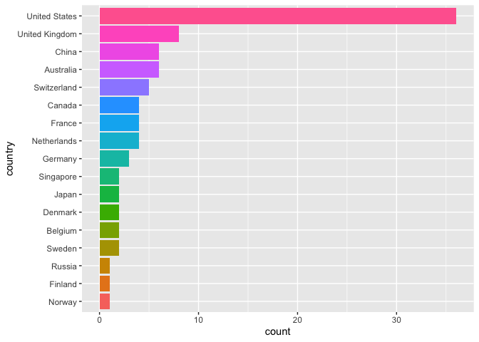

Aggregate University Rankings (2020)
================

Many lists of global university rankings have been produced, each with a
different methodology, in an attempt to quantitatively define which
universities are the best overall. Of these numerous lists, three in
particular stand out as more cited and trusted than the others: the
Academic Ranking of World Universities, the QS World University
Rankings, and the Times Higher Education World University Rankings. This
document displays the top universities by taking the mean scores of all
three lists for each university.

DISCLAIMER: This is not meant to be a statement on which universities
are best or better than others. It is simply intended to be informative
about what kind of information can be obtained by combining the above
ranking lists. Moreover, this document does not make any claim on how
best to combine the scores. A nonweighted mean is chosen for simplicity.
This may change in the future. Only universities for which a single
numeric score existed across all three lists appear in the table. This
document is not intended to profit off the three ranking lists. For more
information on individual methodologies, please visit the respective
websites.

## Top Universities

|    | Name                                           | Aggregate Score | ARWU Score | QS Score | THE Score | Country        |
| :- | :--------------------------------------------- | --------------: | ---------: | -------: | :-------- | :------------- |
| 1  | Harvard University                             |        97.56667 |      100.0 |     97.9 | 94.8      | United States  |
| 2  | Stanford University                            |        89.16667 |       74.2 |     98.4 | 94.9      | United States  |
| 3  | Massachusetts Institute of Technology (MIT)    |        88.00000 |       69.6 |    100.0 | 94.4      | United States  |
| 4  | University of Cambridge                        |        86.30000 |       70.6 |     94.3 | 94.0      | United Kingdom |
| 5  | University of Oxford                           |        83.16667 |       57.2 |     96.7 | 95.6      | United Kingdom |
| 6  | California Institute of Technology             |        83.06667 |       57.7 |     97.0 | 94.5      | United States  |
| 7  | Princeton University                           |        81.20000 |       61.1 |     91.0 | 91.5      | United States  |
| 8  | University of California, Berkeley             |        79.60000 |       65.8 |     80.8 | 92.2      | United States  |
| 9  | University of Chicago                          |        79.33333 |       54.6 |     93.1 | 90.3      | United States  |
| 10 | Yale University                                |        77.70000 |       53.5 |     88.0 | 91.6      | United States  |
| 11 | Columbia University                            |        77.30000 |       58.6 |     86.5 | 86.8      | United States  |
| 12 | ETH Zurich                                     |        76.33333 |       46.1 |     95.0 | 87.9      | Switzerland    |
| 13 | UCL                                            |        75.46667 |       46.6 |     92.9 | 86.9      | United Kingdom |
| 14 | University of Pennsylvania                     |        74.56667 |       46.2 |     88.6 | 88.9      | United States  |
| 15 | Cornell University                             |        74.43333 |       50.4 |     87.6 | 85.3      | United States  |
| 16 | Imperial College London                        |        74.43333 |       40.3 |     93.6 | 89.4      | United Kingdom |
| 17 | Johns Hopkins University                       |        73.40000 |       48.3 |     82.7 | 89.2      | United States  |
| 18 | University of California, Los Angeles          |        72.20000 |       50.3 |     79.2 | 87.1      | United States  |
| 19 | Tsinghua University                            |        70.70000 |       38.1 |     89.2 | 84.8      | China          |
| 20 | University of Toronto                          |        69.86667 |       40.9 |     82.7 | 86.0      | Canada         |
| 21 | University of Michigan-Ann Arbor               |        69.86667 |       41.0 |     84.6 | 84.0      | United States  |
| 22 | Northwestern University                        |        67.56667 |       37.6 |     81.5 | 83.6      | United States  |
| 23 | National University of Singapore               |        67.56667 |       27.7 |     91.5 | 83.5      | Singapore      |
| 24 | New York University                            |        66.83333 |       39.2 |     79.4 | 81.9      | United States  |
| 25 | Duke University                                |        66.80000 |       39.2 |     76.4 | 84.8      | United States  |
| 26 | The University of Edinburgh                    |        66.63333 |       34.7 |     85.8 | 79.4      | United Kingdom |
| 27 | Peking University                              |        66.60000 |       32.4 |     83.5 | 83.9      | China          |
| 28 | The University of Tokyo                        |        66.43333 |       40.1 |     83.2 | 76.0      | Japan          |
| 29 | University of California, San Diego            |        65.06667 |       46.3 |     71.2 | 77.7      | United States  |
| 30 | University of Washington                       |        64.36667 |       46.6 |     66.1 | 80.4      | United States  |
| 31 | The University of Melbourne                    |        63.80000 |       36.0 |     76.5 | 78.9      | Australia      |
| 32 | Swiss Federal Institute of Technology Lausanne |        63.63333 |       27.2 |     89.6 | 74.1      | Switzerland    |
| 33 | King’s College London                          |        63.23333 |       33.6 |     80.0 | 76.1      | United Kingdom |
| 34 | Nanyang Technological University               |        62.96667 |       26.3 |     89.9 | 72.7      | Singapore      |
| 35 | The University of Manchester                   |        62.83333 |       35.5 |     82.1 | 70.9      | United Kingdom |
| 36 | University of British Columbia                 |        62.20000 |       35.4 |     74.8 | 76.4      | Canada         |
| 37 | Kyoto University                               |        61.83333 |       36.3 |     78.9 | 70.3      | Japan          |
| 38 | McGill University                              |        61.13333 |       28.3 |     80.0 | 75.1      | Canada         |
| 39 | PSL University                                 |        60.80000 |       35.5 |     73.3 | 73.6      | France         |
| 40 | Carnegie Mellon University                     |        60.16667 |       26.1 |     73.4 | 81.0      | United States  |
| 41 | Technical University of Munich                 |        59.93333 |       31.4 |     73.6 | 74.8      | Germany        |
| 42 | The Australian National University             |        59.53333 |       28.8 |     80.0 | 69.8      | Australia      |
| 43 | University of Wisconsin-Madison                |        59.00000 |       37.4 |     68.2 | 71.4      | United States  |
| 44 | University of Sydney                           |        58.83333 |       28.5 |     77.1 | 70.9      | Australia      |
| 45 | University of Texas at Austin                  |        58.53333 |       34.9 |     66.7 | 74.0      | United States  |
| 46 | The University of Queensland                   |        58.43333 |       31.4 |     74.5 | 69.4      | Australia      |
| 47 | Heidelberg University                          |        57.93333 |       30.9 |     68.6 | 74.3      | Germany        |
| 48 | Fudan University                               |        57.36667 |       25.5 |     79.9 | 66.7      | China          |
| 49 | University of Illinois at Urbana-Champaign     |        56.53333 |       33.9 |     63.4 | 72.3      | United States  |
| 50 | Washington University in St. Louis             |        56.30000 |       40.9 |     56.9 | 71.1      | United States  |
| 51 | University of North Carolina at Chapel Hill    |        56.10000 |       37.6 |     60.6 | 70.1      | United States  |
| 52 | Monash University                              |        55.63333 |       27.1 |     70.9 | 68.9      | Australia      |
| 53 | University of Copenhagen                       |        55.40000 |       36.9 |     65.5 | 63.8      | Denmark        |
| 54 | Shanghai Jiao Tong University                  |        55.26667 |       29.6 |     74.4 | 61.8      | China          |
| 55 | Zhejiang University                            |        55.03333 |       30.7 |     71.9 | 62.5      | China          |
| 56 | University of Zurich                           |        54.66667 |       31.3 |     67.1 | 65.6      | Switzerland    |
| 57 | University of Bristol                          |        54.30000 |       29.3 |     70.6 | 63.0      | United Kingdom |
| 58 | KU Leuven                                      |        54.20000 |       25.9 |     63.0 | 73.7      | Belgium        |
| 59 | Sorbonne University                            |        54.00000 |       35.3 |     63.3 | 63.4      | France         |
| 60 | University of Southern California              |        51.43333 |       30.1 |     53.8 | 70.4      | United States  |
| 61 | University of Science and Technology of China  |        50.93333 |       28.6 |     60.8 | 63.4      | China          |
| 62 | Boston University                              |        50.93333 |       26.7 |     55.8 | 70.3      | United States  |
| 63 | Utrecht University                             |        50.26667 |       31.6 |     53.8 | 65.4      | Netherlands    |
| 64 | University of California, Santa Barbara        |        50.16667 |       32.4 |     50.2 | 67.9      | United States  |
| 65 | University of California, Davis                |        50.16667 |       26.3 |     55.3 | 68.9      | United States  |
| 66 | University of Helsinki                         |        49.40000 |       28.5 |     57.6 | 62.1      | Finland        |
| 67 | Lomonosov Moscow State University              |        49.33333 |       26.2 |     65.9 | 55.9      | Russia         |
| 68 | Leiden University                              |        49.26667 |       27.7 |     53.4 | 66.7      | Netherlands    |
| 69 | University of Groningen                        |        49.06667 |       28.7 |     53.4 | 65.1      | Netherlands    |
| 70 | Purdue University - West Lafayette             |        48.80000 |       28.0 |     55.9 | 62.5      | United States  |
| 71 | The University of Western Australia            |        48.80000 |       27.1 |     61.0 | 58.3      | Australia      |
| 72 | University of Geneva                           |        48.33333 |       30.6 |     56.8 | 57.6      | Switzerland    |
| 73 | University of Oslo                             |        48.30000 |       30.3 |     55.2 | 59.4      | Norway         |
| 74 | University of Maryland, College Park           |        48.26667 |       31.5 |     50.2 | 63.1      | United States  |
| 75 | McMaster University                            |        48.26667 |       25.8 |     51.5 | 67.5      | Canada         |
| 76 | Uppsala University                             |        47.70000 |       28.4 |     53.7 | 61.0      | Sweden         |
| 77 | Ghent University                               |        47.66667 |       28.9 |     52.5 | 61.6      | Belgium        |
| 78 | Aarhus University                              |        47.03333 |       28.7 |     51.0 | 61.4      | Denmark        |
| 79 | University of Basel                            |        46.80000 |       26.9 |     50.6 | 62.9      | Switzerland    |
| 80 | Paris-Saclay University                        |        46.43333 |       49.6 |     34.0 | 55.7      | France         |
| 81 | Erasmus University Rotterdam                   |        45.66667 |       27.7 |     43.1 | 66.2      | Netherlands    |
| 82 | Vanderbilt University                          |        45.06667 |       30.0 |     44.2 | 61.0      | United States  |
| 83 | University of Pittsburgh                       |        44.83333 |       26.0 |     49.7 | 58.8      | United States  |
| 84 | University of Colorado Boulder                 |        44.13333 |       34.2 |     39.3 | 58.9      | United States  |
| 85 | University of California, Irvine               |        44.06667 |       28.7 |     41.4 | 62.1      | United States  |
| 86 | University of Florida                          |        43.90000 |       26.9 |     47.4 | 57.4      | United States  |
| 87 | Stockholm University                           |        43.16667 |       28.7 |     45.5 | 55.3      | Sweden         |
| 88 | University of Bonn                             |        42.03333 |       27.0 |     38.2 | 60.9      | Germany        |
| 89 | University of Paris                            |        41.00000 |       29.1 |     35.5 | 58.4      | France         |

*Sources:* <http://www.shanghairanking.com/ARWU2020.html>,
<https://www.topuniversities.com/university-rankings/world-university-rankings/2021>,
<https://www.timeshighereducation.com/world-university-rankings/2021/world-ranking>

## Number of Universities in Table by Country

<!-- -->
